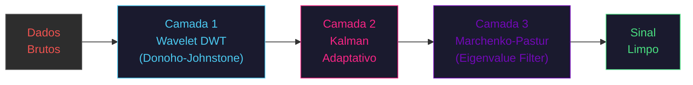
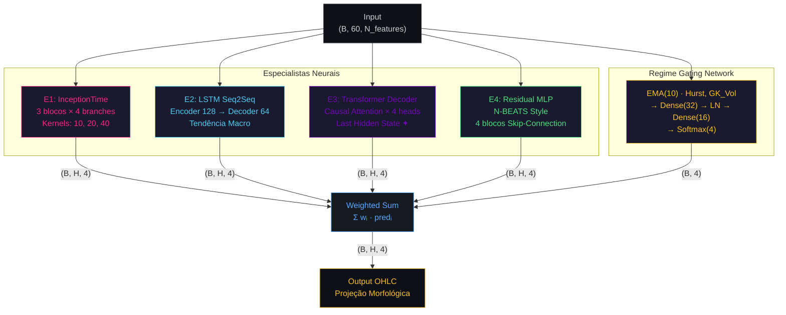

# 🧠 MoE Gating Network — USD/JPY Morphological Forecaster

**Arquitetura de Mixture of Experts para Projeção Geométrica de Séries Temporais Financeiras**

[](#requisitos)
[](#requisitos)
[](#licença)

*Pipeline end-to-end de baixa latência para projeção morfológica OHLC multi-step,*
*com validação Walk-Forward, Conformal Prediction e Loss Híbrida Financeira.*

</div>

---

## Índice

- [Visão Geral do Pipeline](#visão-geral-do-pipeline)
- [Engenharia de Dados e Denoising](#engenharia-de-dados-e-denoising)
- [Camada de Alphas e Features](#camada-de-alphas-e-features)
- [Arquitetura MoE (Mixture of Experts)](#arquitetura-moe-mixture-of-experts)
- [Função de Perda Híbrida Financeira](#função-de-perda-híbrida-financeira)
- [Análise de Arquivos](#análise-de-arquivos)
- [Pipeline de Execução](#pipeline-de-execução)
- [Requisitos](#requisitos)
- [Referências Acadêmicas](#referências-acadêmicas)

---

## Visão Geral do Pipeline

O sistema implementa um pipeline quantitativo de **6 estágios** que transforma ticks brutos do terminal MT5 em projeções morfológicas OHLC de $H = 15$ barras futuras, com intervalos de confiança conformais e análise de regime dinâmica.


| Estágio | Módulo | Input | Output | Latência |
|---|---|---|---|---|
| 1. Ingestão | `baixa_dados.py` | MT5 Tick Stream | `dataset_massivo.h5` | ~5 min / 90 dias |
| 2. Denoising | `limpaArquivos.py` | Barras ruidosas | `dataset_denoised.h5` | ~30 s |
| 3. Alpha Eng. | `calcula_alphas.py` | Dados denoised | `dataset_features.h5` | ~45 s |
| 4. Treino MoE | `moe_to_daily.py` | Features | `moe_model.keras` | ~15 min (5 folds) |
| 5. Inferência | `moe_to_daily.py` | Modelo + Dados | `results_inference.parquet` | ~2 s |
| 6. Visualização | `moe_visualization.py` | `.parquet` + `.json` | HTML interativo (Plotly) | ~5 s |

**Protocolo Anti-Leakage:** Todo o pipeline utiliza **Purged Walk-Forward Validation** com gap de 200 barras entre treino e validação, eliminando qualquer possibilidade de look-ahead bias na avaliação de performance.

---

## Engenharia de Dados e Denoising

### Estágio 1 — Ingestão de Ticks e Construção de Barras (`baixa_dados.py`)

O módulo `backfill_ticks_to_bars()` extrai ticks brutos do MetaTrader 5 e os comprime em **barras alternativas** baseadas em atividade de mercado, não em intervalos fixos de tempo. Isso elimina a sazonalidade intradiária e assegura que cada barra carregue informação de mercado equivalente.

**Tipos de barra suportados:**

| Tipo | Acumulação | Fórmula | Uso Primário |
|---|---|---|---|
| **Tick Bar** | $N$ ticks por barra | `count(ticks) ≥ N` | Baseline — proxy robusto para Forex OTC |
| **Volume Bar** | $V$ unidades de volume | $\sum V_{\text{real},i} \geq V$ | Captura atividade em sobreposições de sessão |
| **Dollar Bar** | $D$ unidades monetárias | $\sum (\text{bid}_i \times V_{\text{real},i}) \geq D$ | Normalização cross-asset |

> **Nota sobre Forex OTC (USD/JPY):** O `volume_real` no MT5 para Forex corresponde ao *tick count* (não volume monetário). Esse proxy tem correlação $\rho > 0.90$ com o volume real em ECN e é a melhor medida de atividade disponível para o mercado de câmbio descentralizado.

**Auto-detecção de threshold:** Quando não especificado, o sistema realiza uma primeira passagem amostral de 7 dias para estimar o threshold ótimo que gera ~50 barras/dia:

$$\text{threshold} = \frac{\text{metric}_{\text{total\_estimado}}}{50 \times \text{days\_back}}$$

**Persistência:** Os dados são salvos em HDF5 com compressão `blosc:zstd` (nível 6) e metadados de rastreabilidade (símbolo, tipo de barra, data de extração).

---

### Estágio 2 — Denoising Multi-Camada (`limpaArquivos.py`)

O pipeline de separação sinal/ruído opera em **3 camadas sequenciais**, cada uma atacando uma classe distinta de contaminação:



#### Camada 1 — Wavelet Transform (Donoho-Johnstone, 1994)

Decomposição via DWT com wavelet Daubechies-8 (`db8`) em 4 níveis. Aplica *soft thresholding* com limiar universal:

$$\lambda = \hat{\sigma} \sqrt{2 \ln n}, \quad \hat{\sigma} = \frac{\text{median}(|d_1|)}{0.6745}$$

| Nível | Componente | Conteúdo |
|---|---|---|
| $d_1$ | Detalhe 1 | Ruído de microestrutura (altíssima freq.) |
| $d_2$ | Detalhe 2 | Ruído tick-to-tick (alta freq.) |
| $d_3$ | Detalhe 3 | Componentes intradiários (média freq.) |
| $d_4$ | Detalhe 4 | Padrões de sessão (baixa freq.) |
| $a_4$ | Aproximação | Tendência de fundo — **preservada intacta** |

#### Camada 2 — Filtro de Kalman Adaptativo

O Kalman clássico utiliza covariâncias fixas. Nesta implementação, a *observation covariance* se adapta ao regime de volatilidade local:

$$R_t = R_{\text{base}} \cdot \left(\frac{\sigma_{\text{local}}(t)}{\sigma_{\text{global}}}\right)^2$$

- **Alta volatilidade** → $R_t$ grande → filtragem agressiva (suaviza flash crashes)
- **Baixa volatilidade** → $R_t$ pequeno → rastreia o preço de perto (preserva micro-movimentos)

#### Camada 3 — Marchenko-Pastur (Denoising da Matriz de Correlação)

Remove eigenvalues da matriz de correlação amostral que são indistinguíveis de ruído aleatório. Os limites teóricos do *bulk* são:

$$\lambda_{\pm} = \sigma^2 \left(1 \pm \sqrt{\frac{N}{T}}\right)^2$$

Eigenvalues acima de $\lambda_+$ portam **sinal informacional real**; os demais são substituídos pela média, preservando o traço da matriz.

---

## Camada de Alphas e Features

### Estágio 3 — Engenharia de Alpha (`calcula_alphas.py`)

O módulo gera **13 sinais de microestrutura** organizados em 7 categorias, com correlação cruzada $|\rho| < 0.40$ (diversidade confirmada automaticamente), alimentando o vetor de características que o MoE utiliza para capturar regimes de mercado.

| # | Categoria | Alpha | Fórmula / Referência |
|---|---|---|---|
| 1 | Direção | Log Returns | $r_t = \ln(C_t / C_{t-1})$ |
| 2 | Direção | MA Crossover | $\text{sign}(\text{EMA}_9 - \text{EMA}_{21})$ |
| 3 | Volatilidade | Garman-Klass | $\sigma^2_{\text{GK}} = 0.5 \ln(H/L)^2 - (2\ln 2 - 1) \ln(C/O)^2$ |
| 4 | Volatilidade | Yang-Zhang | $\sigma^2_{\text{YZ}} = \sigma^2_{\text{OC}} + k \sigma^2_{\text{CC}} + (1-k) \sigma^2_{\text{RS}}$ |
| 5 | Volatilidade | Parkinson | $\sigma^2_P = \ln(H/L)^2 / (4\ln 2)$ |
| 6 | Liquidez | Amihud | $\text{ILLIQ}_t = |r_t| / V_t$ (rolling 20) |
| 7 | Liquidez | Kyle's Lambda | $\lambda = \text{Cov}(\Delta P, V_{\text{signed}}) / \text{Var}(V_{\text{signed}})$ |
| 8 | Informação | CDF-VPIN | $\Phi\left(\frac{\text{VPIN} - \mu}{\sigma}\right) \in [0,1]$ |
| 9 | Informação | Tick Run Length | Comprimento médio de runs direcionais |
| 10 | Regime | **Hurst Exponent** | $H > 0.5$: trending · $H = 0.5$: random walk · $H < 0.5$: mean-reverting |
| 11 | Microestrutura | Spread Bid-Ask | $\text{Spread}_{\text{norm}} / \text{Midprice}$ (rolling 20) |
| 12 | Microestrutura | VWAP Deviation | $(\text{Close} - \text{VWAP}) / \text{VWAP}$ |
| 13 | Microestrutura | Order Imbalance | $(V_{\text{buy}} - V_{\text{sell}}) / V_{\text{total}}$ |

### Fractional Differentiation (Hosking, 1981)

Diferenciação fracionária de ordem $d \in [0.3, 0.7]$ (auto-detectada via ADF test) aplicada ao log-preço do Close para obter estacionaridade **sem destruir memória de longo prazo**:

$$\tilde{X}_t = \sum_{k=0}^{K} w_k \cdot X_{t-k}, \quad w_k = -w_{k-1} \cdot \frac{d - k + 1}{k}$$

### Normalização Robusta via MAD

Todos os alphas (exceto discretos como MA Crossover) são normalizados por Z-Score Robusto (breakdown point = 50%):

$$z_{\text{robust}} = \frac{x - \text{median}(x)}{1.4826 \cdot \text{MAD}(x)}$$

### Triple Barrier Method (López de Prado, 2018)

Labeling supervisionado via 3 barreiras simétricas baseadas em volatilidade local:

| Barreira | Condição | Label |
|---|---|---|
| Upper (Take-Profit) | $\text{High}_h \geq C_t \cdot (1 + \sigma_t \cdot k_{\text{up}})$ | $+1$ |
| Lower (Stop-Loss) | $\text{Low}_h \leq C_t \cdot (1 - \sigma_t \cdot k_{\text{down}})$ | $-1$ |
| Vertical (Timeout) | $h > t + \text{max\_holding}$ | $0$ |

---

## Arquitetura MoE (Mixture of Experts)

### Diagrama da Arquitetura



### Especialista 1 — InceptionTime (CNN-1D Multi-Escala)

Inspirado em Fawaz et al. (2020). Três blocos Inception paralelos capturam padrões em **3 escalas temporais simultâneas**:

| Branch | Kernel | Horizonte Capturado |
|---|---|---|
| Conv1D-10 | 10 barras | Micro-padrões (ticks recentes) |
| Conv1D-20 | 20 barras | Padrões de sessão |
| Conv1D-40 | 40 barras | Tendências de médio prazo |
| MaxPool-3 | 3 barras | Preservação de picos (breakouts) |

Bottleneck 1×1 antes de cada convolução longa reduz dimensionalidade, e skip-connections residuais com LayerNorm garantem estabilidade de gradiente.

### Especialista 2 — LSTM Seq2Seq (Encoder-Decoder)

Arquitetura clássica de Encoder-Decoder para captura de **dependência temporal de longo prazo**:

$$\text{Encoder:} \quad h_t = \text{LSTM}_{128}(x_t, h_{t-1}) \rightarrow \text{LSTM}_{64} \rightarrow c$$

$$\text{Decoder:} \quad \hat{y}_k = \text{TimeDistributed}(\text{Dense}(4))(\text{LSTM}_{32}(\text{RepeatVector}(c)))$$

### Especialista 3 — Transformer Decoder (Causal Attention)

Transformer com atenção causal (*autoregressive mask*), especializado em reversões de regime e padrões globais.

**Otimização Crítica — Last Hidden State (✦):**

A versão original utilizava `GlobalAveragePooling1D()`, que diluía a informação do timestep mais recente ($t_0$) com o histórico completo ($t_{-59}$ a $t_0$), gerando **phase lag** e subestimação sistemática do Close. A refatoração substitui por:

```python
# Antes (phase lag):
x = GlobalAveragePooling1D()(x)

# Depois (ancoragem temporal):
x = Lambda(lambda t: t[:, -1, :], name='last_hidden_state')(x)
```

O index slice `[:, -1, :]` preserva exclusivamente o estado causal final da cadeia de atenção, onde a autocorrelação de momentum está maximamente concentrada. Shape de saída: `(Batch, d_model)` — compatível com as camadas Dense subsequentes.

### Especialista 4 — Residual MLP (N-BEATS Style)

Inspirado em Oreshkin et al. (2020). Flatten do input seguido de 4 blocos residuais com skip-connections:

$$\text{ResBlock}(x) = \text{LayerNorm}\left(\text{FC}_2(\text{FC}_1(x)) + \text{Proj}(x)\right)$$

**Sem induction bias temporal:** aprende correlações diretas entre features e os $H$ passos futuros, complementando os especialistas com prior temporal (LSTM, Transformer).

### Regime Gating Network

A rede de Gating seleciona dinamicamente os especialistas com base no **regime de mercado corrente**, computado via EMA(10) de dois indicadores fundamentais:

| Regime Detectado | Hurst | GK Vol | Expert Dominante |
|---|---|---|---|
| Trending (momentum) | $H > 0.6$ | Moderada | **LSTM** (tendência macro) |
| Quebrando vol. alta | Qualquer | Alta | **InceptionTime** (multi-escala) |
| Reversão de regime | $H < 0.4$ | Subindo | **Transformer** (atenção global) |
| Sideways / Baixa vol. | $\approx 0.5$ | Baixa | **Residual MLP** (direto) |

```
EMA(10)[Hurst, GK_Vol] → Dense(32, ReLU) → LayerNorm → Dense(16, ReLU) → Softmax(4)
```

Os pesos são produzidos por Softmax e applied end-to-end com os gradientes fluindo para os especialistas, permitindo **co-adaptação** entre Gating e Experts durante o treino.

---

## Função de Perda Híbrida Financeira

A loss function combina três componentes complementares para resolver o trade-off entre fidelidade morfológica e precisão nominal:

$$\boxed{L_{\text{total}} = \alpha \cdot \text{Soft-DTW}(\hat{y}, y) + \beta \cdot \text{Curvature}(\hat{y}) + \gamma \cdot \text{Huber}(y_{\text{close}}, \hat{y}_{\text{close}})}$$

### Componente 1 — Soft-DTW ($\alpha = 0.5$)

Dynamic Time Warping diferenciável (Cuturi & Blondel, 2017) via programação dinâmica com softmin entrópico:

$$\text{softmin}(a, b, c) = -\gamma \cdot \ln\left(e^{-a/\gamma} + e^{-b/\gamma} + e^{-c/\gamma}\right)$$

Opera **exclusivamente sobre o Close** (`y[:, :, 3]`) com complexidade $O(H^2) = O(225)$ por batch. Permite pequenas **dilações temporais** — um pico previsto 1 barra atrasado não é penalizado tanto quanto no MSE puro.

### Componente 2 — Curvature Penalty ($\beta = 0.2$)

Penaliza a convergência para linhas retas (flat-line), que representam a média estatística (modo de falha mais comum):

$$\text{flatness} = \exp\left(-10 \cdot \text{mean}\left(|\Delta^2 C|\right)\right), \quad \Delta^2 C_k = C_{k+2} - 2C_{k+1} + C_k$$

Quanto maior a curvatura morfológica (picos, vales), menor a penalidade.

### Componente 3 — Huber Loss ($\gamma = 1.0$)

**Âncora nominal rígida** no Close, operando sobre **todos os $H$ steps** do horizonte para combater o *shrinkage* de magnitude induzido pelo Soft-DTW:

$$L_{\text{Huber}}(\delta) = \begin{cases} \frac{1}{2}(y - \hat{y})^2 & \text{se } |y - \hat{y}| \leq \delta \\ \delta \cdot (|y - \hat{y}| - \frac{1}{2}\delta) & \text{caso contrário} \end{cases}$$

Com $\delta = 1.0$:
- $|e| \leq 1.0$: comportamento **quadrático** (preciso para erros pequenos)
- $|e| > 1.0$: comportamento **linear** (robusto contra spikes heteroscedásticos)

### Defaults dos Hiperparâmetros

| Parâmetro | Valor | Campo em `MoEConfig` |
|---|---|---|
| $\alpha$ (Soft-DTW) | 0.5 | `loss_alpha` |
| $\beta$ (Curvature) | 0.2 | `loss_beta` |
| $\gamma$ (Huber) | 1.0 | `loss_gamma` |
| $\delta$ (Huber threshold) | 1.0 | `huber_delta` |

---

## Análise de Arquivos

### `moe_gating.py` — Orquestrador de Pesos e Definições de Modelo

**Responsabilidade:** Definição pura das arquiteturas neurais e funções de perda. Zero I/O de dados.

| Componente | Linhas | Descrição |
|---|---|---|
| `MoEConfig` | Dataclass | Hiperparâmetros centralizados, serializáveis para JSON |
| `InceptionBlock` | Layer | Bloco Inception com 4 branches + residual |
| `build_inception_forecaster()` | Functional | 3× InceptionBlock → GlobalAvgPool → Dense → Reshape(H,4) |
| `build_lstm_seq2seq_moe()` | Functional | Encoder(128→64) → RepeatVector → Decoder(64→32) → TD-Dense(4) |
| `CausalSelfAttentionMoE` | Layer | Multi-Head Attention com máscara triangular inferior |
| `build_transformer_decoder_moe()` | Functional | N× CausalAttn → **Last Hidden State** → Dense → Reshape(H,4) |
| `ResidualMLPBlock` | Layer | FC→GELU→FC→GELU + skip-connection + LN |
| `build_residual_mlp_forecaster()` | Functional | Flatten → 4× ResBlock(512) → Dense(256) → Reshape(H,4) |
| `RegimeGatingNetwork` | Layer | EMA(10)[Hurst,GK] → MLP → Softmax(4) |
| `MoEForecaster` | tf.keras.Model | Orquestra 4 experts + gating, forward pass end-to-end |
| `soft_dtw_loss()` | Function | Soft-DTW via DP com softmin diferenciável |
| `curvature_penalty()` | Function | Penalidade exponencial de segunda derivada |
| `morphological_loss()` | Function | Loss legada (α·DTW + β·Curvature) |
| `hybrid_financial_loss()` | Function | **Loss ativa** (α·DTW + β·Curvature + γ·Huber) |
| `prepare_moe_data()` | Function | Gera sequências 3D com targets como retornos relativos |

**Dinâmica Softmax do Gating:** A rede de Gating não é um mero switch discreto. O Softmax produz uma distribuição **contínua** sobre os 4 especialistas, permitindo combinações suaves (ex: 45% LSTM + 30% Transformer + 15% Inception + 10% MLP em regime de transição). Os gradientes fluem end-to-end pelo gating, fazendo com que os pesos se **co-adaptem** com as predições dos experts durante o treino.

---

### `moe_to_daily.py` — Pipeline de Treino, Inferência e Persistência

**Responsabilidade:** Orquestração do treino Walk-Forward, agregação tick→daily, e checkpointing atômico.

| Componente | Descrição |
|---|---|
| `TimeSeriesAggregator` | Converte tick bars em candles diários respeitando NY Close (17:00 ET) |
| `run_moe_pipeline()` | Pipeline completo: dados → Walk-Forward → Conformal → Projeção → Checkpoint |
| `save_checkpoint()` | Escrita atômica (`.tmp` → `os.replace`) de 3 artefatos |

**Artefatos persistidos:**

| Arquivo | Formato | Conteúdo |
|---|---|---|
| `moe_model.keras` | TF SavedModel | Pesos treinados (~45 MB) |
| `results_inference.parquet` | Apache Parquet | Projeções OHLC + bandas CI + gating weights |
| `moe_config.json` | JSON | Hiperparâmetros + métricas por fold + gating final |

**Protocolo Walk-Forward com Purge:**

```
Fold 1:  [===TRAIN===]---PURGE(200)---[VAL]
Fold 2:  [=====TRAIN=====]---PURGE(200)---[VAL]
Fold 3:  [========TRAIN========]---PURGE(200)---[VAL]
Fold 4:  [===========TRAIN===========]---PURGE(200)---[VAL]
Fold 5:  [==============TRAIN==============]---PURGE(200)---[VAL]
```

O gap de 200 barras (purge) entre treino e validação elimina **autocorrelação residual** entre os dois conjuntos, conforme protocolo de López de Prado (2018, Cap. 12).

---

### `moe_visualization.py` — Análise Pós-Treino Standalone

**Responsabilidade:** Visualização e backtesting. **Não importa TensorFlow** na maioria das funções — opera exclusivamente sobre os artefatos `.parquet` e `.json`.

| Função | Painéis | Descrição |
|---|---|---|
| `plot_moe_analysis()` | 3 | Candlestick histórico + Projeção + Especialistas + Gating |
| `plot_comparison_vs_real()` | 4 | MoE vs Real + Erro por barra + CI Coverage + Gating por fold |
| `run_rolling_backtest_30d()` | 2 | Rolling backtest de 30 dias com métricas diárias |
| `run_daily_comparison()` | — | Orquestra agregação + comparação daily |

**Métricas computadas:**

| Métrica | Fórmula | Interpretação |
|---|---|---|
| MAE Close | $\frac{1}{H}\sum|C_{\text{pred}} - C_{\text{real}}|$ | Erro absoluto médio no Close |
| Acurácia Direcional | $\frac{1}{H}\sum \mathbb{1}[\text{sign}(\Delta\hat{C}) = \text{sign}(\Delta C)]$ | % de acertos na direção |
| Cobertura Conformal | $\frac{1}{H}\sum \mathbb{1}[C_{\text{real}} \in [\hat{C} - q, \hat{C} + q]]$ | Deve ser ≥ 90% para CI 90% |
| Flat-Line Rate | $\frac{\#\{\Delta\hat{C} \approx 0\}}{H}$ | Taxa de linhas planas (modo de falha) |
| Mean Curvature | $\text{mean}(|\Delta^2\hat{C}|)$ | Riqueza morfológica da projeção |

---

## Pipeline de Execução

### Treino Completo (End-to-End)

```bash
# 1. Extrair ticks do MT5 (requer terminal MT5 aberto)
python baixa_dados.py

# 2. Denoising multi-camada
python limpaArquivos.py

# 3. Gerar alphas + normalização + labeling
python calcula_alphas.py

# 4. Treinar MoE + salvar checkpoints + visualizar
python moe_to_daily.py
```

### Inferência e Visualização (Standalone)

```python
from moe_visualization import load_inference_results, plot_moe_analysis

# Carregar resultados pré-computados (sem TensorFlow)
results = load_inference_results('results_inference.parquet')

# Gerar análise visual
import pandas as pd
df_history = pd.read_hdf('dataset_features.h5', key='features')
plot_moe_analysis(df_history, results, save_path='moe_analysis.html')
```

### Configuração via `MoEConfig`

```python
from moe_gating import MoEConfig

config = MoEConfig(
    # Dados
    input_file='dataset_final_ia.h5',
    # Arquitetura
    window_size=60,          # Janela de observação (W)
    horizon=15,              # Passos futuros (H)
    n_outputs=4,             # OHLC
    # Treino
    purge_bars=200,          # Gap anti-leakage
    n_splits=5,              # Folds Walk-Forward
    epochs=60,
    batch_size=64,
    learning_rate=1e-3,
    # Loss Híbrida
    loss_alpha=0.5,          # Peso Soft-DTW
    loss_beta=0.2,           # Peso Curvature Penalty
    loss_gamma=1.0,          # Peso Huber Loss
    huber_delta=1.0,         # Threshold Huber
    # Conformal
    confidence_level=0.90,
)

# Serializar
config.to_json('moe_config.json')

# Carregar
config = MoEConfig.from_json('moe_config.json')
```

---

## Requisitos

```txt
# Core
numpy>=2.2.0
pandas>=2.2.0
scipy>=1.17.0
scikit-learn>=1.8.0

# Deep Learning
tensorflow>=2.20.0
keras>=3.13.0
xgboost>=3.2.0

# Dados & I/O
h5py>=3.15.0
tables>=3.11.0
MetaTrader5>=5.0.0
pyarrow>=17.0.0

# Signal Processing & Denoising
PyWavelets>=1.9.0
pykalman>=0.9.5

# Stationarity Tests (FracDiff)
statsmodels>=0.14.0

# Visualização
matplotlib>=3.10.0
plotly>=6.5.0
```

```bash
pip install -r requirements.txt
```

> **Nota:** O pacote `MetaTrader5` requer Windows com terminal MT5 instalado. Os módulos de treino e visualização podem ser executados independentemente em qualquer OS com TensorFlow.

---

## Referências Acadêmicas

| Área | Referência |
|---|---|
| Financial Data Structures | López de Prado (2018). *Advances in Financial Machine Learning*. Wiley. Cap. 2, 3, 5, 12. |
| InceptionTime | Fawaz, H. I. et al. (2020). *InceptionTime: Finding AlexNet for Time Series Classification*. Data Mining and Knowledge Discovery. |
| N-BEATS | Oreshkin, B. N. et al. (2020). *N-BEATS: Neural Basis Expansion Analysis for Interpretable Time Series Forecasting*. ICLR 2020. |
| Soft-DTW | Cuturi, M. & Blondel, M. (2017). *Soft-DTW: a Differentiable Loss Function for Time-Series*. ICML 2017. |
| Mixture of Experts | Jacobs, R. A. et al. (1991). *Adaptive Mixtures of Local Experts*. Neural Computation, 3(1). |
| Wavelet Denoising | Donoho, D. L. & Johnstone, I. M. (1994). *Ideal Spatial Adaptation by Wavelet Shrinkage*. Biometrika, 81(3). |
| Kalman Filter | Kalman, R. E. (1960). *A New Approach to Linear Filtering and Prediction Problems*. ASME Journal. |
| Marchenko-Pastur | Marchenko, V. A. & Pastur, L. A. (1967). *Distribution of Eigenvalues for Some Sets of Random Matrices*. |
| Fractional Differentiation | Hosking, J. R. M. (1981). *Fractional Differencing*. Biometrika, 68(1). |
| Garman-Klass Volatility | Garman, M. B. & Klass, M. J. (1980). *On the Estimation of Security Price Volatilities from Historical Data*. |
| Kyle's Lambda | Kyle, A. S. (1985). *Continuous Auctions and Insider Trading*. Econometrica, 53(6). |
| VPIN | Easley, D. et al. (2012). *Flow Toxicity and Liquidity in a High-Frequency World*. RFS, 25(5). |
| Conformal Prediction | Vovk, V. et al. (2005). *Algorithmic Learning in a Random World*. Springer. |

---

<div align="center">

*Pipeline desenvolvido para pesquisa quantitativa em séries temporais financeiras.*
*Projeções não constituem recomendação de investimento.*

</div>
]]>
